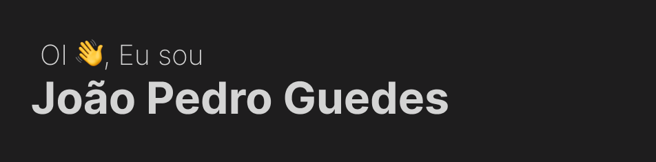

# Hello Devs 

📫 Me contate: 

Email: jpgbarbieri@gmail.com

  
<h1>🙍‍♂️ Quem sou eu?</h1>

  Meu nome é João Pedro e Eu sou aluno do 3EM do Sesi/Senai de Brotas, fiz alguns cursos de programação sobre php, c#, javascrip, etc, trabalhei por um tempo fazendo um API e sua parte do front.

<h1>🚀 Eu no Github</h1>

|_**Status do Github**_|_**Top Linguagens**_|
|-----------|-------------|
|||

 
